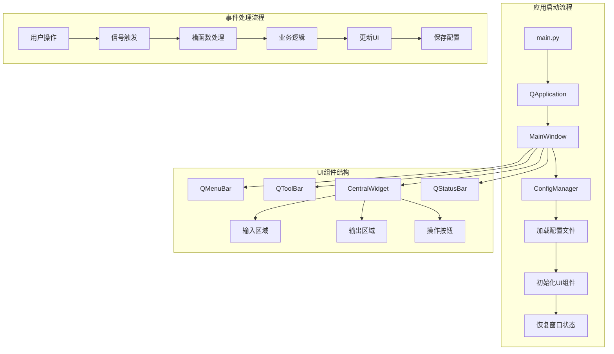
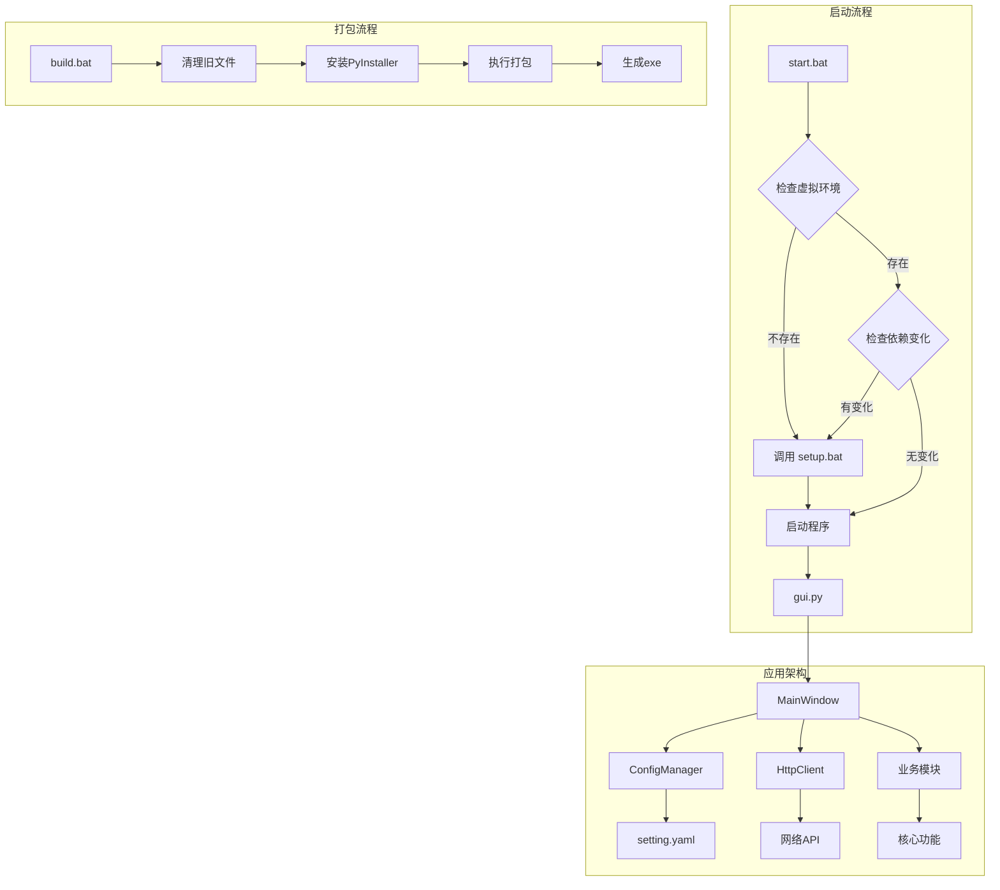

# 通用 Python 桌面项目架构文档

> 本文档基于现有项目框架总结，用于创建通用工程模板时参考。UI层采用 PyQt 替代原 webview 方案。

---

## 目录

1. [项目目录结构规范](#1-项目目录结构规范)
2. [Python 虚拟环境管理](#2-python-虚拟环境管理)
3. [配置文件管理](#3-配置文件管理)
4. [PyQt UI 层架构设计](#4-pyqt-ui-层架构设计)
5. [网络请求封装方案](#5-网络请求封装方案)
6. [PyInstaller 打包配置](#6-pyinstaller-打包配置)
7. [启动脚本和安装脚本模板](#7-启动脚本和安装脚本模板)
8. [完整项目模板示例](#8-完整项目模板示例)

---

## 1. 项目目录结构规范

### 1.1 标准目录结构

```
project-root/
├── .gitignore                    # Git 忽略配置
├── app.ico                       # 应用图标
├── logo.png                      # 应用Logo
├── README.md                     # 项目说明文档
├── README.zh-CN.md               # 中文说明文档
├── requirements.txt              # Python 依赖清单
├── setup.bat                     # 环境安装脚本
├── start.bat                     # 启动脚本
├── build.bat                     # 打包脚本
├── {项目名}.spec                  # PyInstaller 配置文件
│
├── config/                       # 配置文件目录
│   ├── setting.yaml              # YAML 格式配置（推荐）
│   └── setting.cfg               # INI 格式配置（可选）
│
├── script/                       # Python 源码目录
│   ├── __init__.py
│   ├── main.py                   # 程序入口
│   ├── gui.py                    # PyQt UI 主模块
│   ├── config_manager.py         # 配置管理模块
│   ├── network.py                # 网络请求模块
│   └── utils.py                  # 工具函数模块
│
├── resources/                    # 资源文件目录
│   ├── icons/                    # 图标资源
│   ├── images/                   # 图片资源
│   └── styles/                   # QSS 样式表
│
├── rundata/                      # 运行时数据目录
│   ├── input/                    # 输入文件
│   └── output/                   # 输出文件
│
├── build/                        # 打包临时目录（自动生成）
└── dist/                         # 打包输出目录（自动生成）
```

### 1.2 目录说明

| 目录/文件 | 用途 | 是否纳入版本控制 |
|-----------|------|------------------|
| `config/` | 存放配置文件，支持 YAML 和 INI 格式 | 是 |
| `script/` | Python 源代码，核心业务逻辑 | 是 |
| `resources/` | 静态资源文件（图标、图片、样式） | 是 |
| `rundata/` | 运行时产生的数据文件 | 否（或部分） |
| `build/` | PyInstaller 构建临时文件 | 否 |
| `dist/` | 打包输出的可执行文件 | 否 |
| `.venv/` | Python 虚拟环境 | 否 |

---

## 2. Python 虚拟环境管理

### 2.1 环境安装脚本 (setup.bat)

```batch
@echo off
setlocal EnableExtensions EnableDelayedExpansion
chcp 65001 >nul

cd /d "%~dp0"
title {项目名称} - 环境安装器

set "VENV_DIR=.venv"
set "VENV_PY=%VENV_DIR%\Scripts\python.exe"
set "VENV_CFG=%VENV_DIR%\pyvenv.cfg"
set "REQUIREMENTS=requirements.txt"
set "SNAPSHOT_FILE=%VENV_DIR%\.requirements.snapshot"
set "PYTHON_VERSION=3.12"

echo ========================================
echo   {项目名称} - 环境准备
echo ========================================
echo.

:: 检查 py 启动器
where py >nul 2>nul
if errorlevel 1 (
    echo [错误] 未找到 py 启动器。
    echo 请先安装 Python %PYTHON_VERSION%，并确保勾选 Python Launcher。
    echo.
    pause
    exit /b 1
)

:: 检查指定 Python 版本
py -%PYTHON_VERSION% -c "import sys" >nul 2>nul
if errorlevel 1 (
    echo [错误] 未检测到 Python %PYTHON_VERSION%。
    echo 请先安装 Python %PYTHON_VERSION%。
    echo.
    pause
    exit /b 1
)

:: 创建虚拟环境
if not exist "%VENV_PY%" (
    echo [信息] 未检测到虚拟环境，正在创建...
    py -%PYTHON_VERSION% -m venv "%VENV_DIR%"
    if errorlevel 1 (
        echo [错误] 创建虚拟环境失败。
        echo.
        pause
        exit /b 1
    )
)

:: 验证虚拟环境版本
set "VENV_VER="
if exist "%VENV_CFG%" (
    for /f "tokens=1,* delims==" %%A in (%VENV_CFG%) do (
        set "KEY=%%A"
        set "VAL=%%B"
        set "KEY=!KEY: =!"
        if /i "!KEY!"=="version" (
            set "VENV_VER=!VAL!"
            set "VENV_VER=!VENV_VER: =!"
        )
    )
)

echo [信息] 当前虚拟环境版本：%VENV_VER%
echo %VENV_VER% | findstr /b "%PYTHON_VERSION%." >nul
if errorlevel 1 (
    echo [警告] 当前虚拟环境不是 Python %PYTHON_VERSION%，正在重建...
    rmdir /s /q "%VENV_DIR%"
    py -%PYTHON_VERSION% -m venv "%VENV_DIR%"
    if errorlevel 1 (
        echo [错误] 重建虚拟环境失败。
        echo.
        pause
        exit /b 1
    )
)

:: 升级基础工具
echo [信息] 升级 pip / setuptools / wheel ...
"%VENV_PY%" -m pip install --upgrade pip setuptools wheel
if errorlevel 1 (
    echo [错误] 升级基础工具失败。
    echo.
    pause
    exit /b 1
)

:: 安装依赖
if exist "%REQUIREMENTS%" (
    echo [信息] 正在安装 requirements.txt 中的依赖...
    "%VENV_PY%" -m pip install -r "%REQUIREMENTS%"
    if errorlevel 1 (
        echo [错误] 安装 requirements.txt 依赖失败。
        echo.
        pause
        exit /b 1
    )
    copy /y "%REQUIREMENTS%" "%SNAPSHOT_FILE%" >nul
) else (
    echo [警告] 未找到 requirements.txt
    pause
    exit /b 1
)

echo.
echo [成功] 环境准备完成。
echo.
endlocal
exit /b 0
```

### 2.2 依赖清单 (requirements.txt)

```text
# PyQt UI 框架
PyQt6>=6.4.0
# 或使用 PyQt5
# PyQt5>=5.15.0

# YAML 配置文件支持
pyyaml>=6.0

# Excel 文件处理（可选）
openpyxl>=3.1.0

# 网络请求（可选）
requests>=2.28.0

# 打包工具（开发时安装）
pyinstaller>=6.0.0
```

### 2.3 关键特性

1. **版本锁定**：指定 Python 版本（如 3.12），确保环境一致性
2. **自动重建**：检测到版本不匹配时自动重建虚拟环境
3. **依赖快照**：通过 `.requirements.snapshot` 跟踪依赖变化
4. **错误处理**：每个步骤都有错误检测和友好提示

---

## 3. 配置文件管理

### 3.1 YAML 配置方案（推荐）

#### 配置文件示例 (config/setting.yaml)

```yaml
# 应用配置
app:
  name: "应用程序名称"
  version: "1.0.0"
  language: "zh-CN"

# 用户设置
user_settings:
  input_path: "./rundata/input"
  output_path: "./rundata/output"
  last_opened_file: ""
  window_geometry: ""
  window_state: ""

# 功能配置
features:
  enable_auto_save: true
  enable_notifications: true
  max_recent_files: 10

# UI 提示信息
ui_tips:
  - "提示信息1"
  - "提示信息2"
  - "提示信息3"
```

#### 配置管理模块 (script/config_manager.py)

```python
#!/usr/bin/env python
# -*- coding: utf-8 -*-
"""
配置文件管理模块
支持 YAML 格式配置的读写操作
"""

import os
from pathlib import Path
from typing import Any, Dict, Optional

try:
    import yaml
except ImportError as exc:
    raise RuntimeError("缺少 PyYAML 依赖，请先执行: pip install pyyaml") from exc


class ConfigManager:
    """配置管理器，负责配置文件的读写和默认值管理"""

    def __init__(self, config_path: Optional[Path] = None):
        """
        初始化配置管理器

        Args:
            config_path: 配置文件路径，默认为 config/setting.yaml
        """
        if config_path is None:
            # 自动检测应用目录
            if getattr(sys, 'frozen', False):
                # PyInstaller 打包后的路径
                self.app_dir = Path(sys.executable).resolve().parent
                self.resource_dir = Path(getattr(sys, '_MEIPASS', self.app_dir)).resolve()
            else:
                # 开发环境路径
                self.app_dir = Path(__file__).resolve().parent.parent
                self.resource_dir = self.app_dir

            self.config_path = self.app_dir / 'config' / 'setting.yaml'
        else:
            self.config_path = Path(config_path)
            self.app_dir = self.config_path.parent.parent

        self._config: Dict[str, Any] = {}
        self._defaults: Dict[str, Any] = self._get_defaults()

    def _get_defaults(self) -> Dict[str, Any]:
        """获取默认配置"""
        return {
            'app': {
                'name': '应用程序',
                'version': '1.0.0',
                'language': 'zh-CN',
            },
            'user_settings': {
                'input_path': './rundata/input',
                'output_path': './rundata/output',
                'last_opened_file': '',
                'window_geometry': '',
                'window_state': '',
            },
            'features': {
                'enable_auto_save': True,
                'enable_notifications': True,
                'max_recent_files': 10,
            },
            'ui_tips': [],
        }

    def load(self) -> Dict[str, Any]:
        """
        加载配置文件

        Returns:
            配置字典，合并了默认值和文件配置
        """
        if not self.config_path.exists():
            self._config = self._deep_copy(self._defaults)
            self.save()
            return self._config

        with open(self.config_path, 'r', encoding='utf-8') as f:
            file_config = yaml.safe_load(f) or {}

        # 深度合并默认配置和文件配置
        self._config = self._deep_merge(self._defaults, file_config)
        return self._config

    def save(self, config: Optional[Dict[str, Any]] = None) -> None:
        """
        保存配置到文件

        Args:
            config: 要保存的配置字典，默认保存当前配置
        """
        if config is not None:
            self._config = config

        # 确保目录存在
        self.config_path.parent.mkdir(parents=True, exist_ok=True)

        with open(self.config_path, 'w', encoding='utf-8') as f:
            yaml.safe_dump(self._config, f, allow_unicode=True, sort_keys=False)

    def get(self, key: str, default: Any = None) -> Any:
        """
        获取配置值（支持点分隔的嵌套键）

        Args:
            key: 配置键，如 'user_settings.input_path'
            default: 默认值

        Returns:
            配置值
        """
        keys = key.split('.')
        value = self._config

        for k in keys:
            if isinstance(value, dict) and k in value:
                value = value[k]
            else:
                return default

        return value

    def set(self, key: str, value: Any, auto_save: bool = True) -> None:
        """
        设置配置值

        Args:
            key: 配置键，如 'user_settings.input_path'
            value: 配置值
            auto_save: 是否自动保存到文件
        """
        keys = key.split('.')
        config = self._config

        for k in keys[:-1]:
            if k not in config:
                config[k] = {}
            config = config[k]

        config[keys[-1]] = value

        if auto_save:
            self.save()

    def resolve_path(self, path_value: str) -> str:
        """
        将相对路径解析为绝对路径

        Args:
            path_value: 路径值（相对或绝对）

        Returns:
            绝对路径字符串
        """
        if not path_value:
            return ''

        path_obj = Path(path_value)
        if not path_obj.is_absolute():
            path_obj = (self.app_dir / path_value).resolve()

        return str(path_obj)

    def normalize_path(self, path_value: str) -> str:
        """
        将路径规范化为相对于项目根目录的相对路径

        Args:
            path_value: 路径值

        Returns:
            相对路径字符串
        """
        if not path_value:
            return ''

        path_obj = Path(path_value)
        if not path_obj.is_absolute():
            path_obj = (self.app_dir / path_value).resolve()
        else:
            path_obj = path_obj.resolve()

        try:
            relative = path_obj.relative_to(self.app_dir)
            return relative.as_posix() or '.'
        except ValueError:
            return os.path.relpath(path_obj, self.app_dir).replace('\\', '/')

    @staticmethod
    def _deep_copy(d: Dict) -> Dict:
        """深拷贝字典"""
        import copy
        return copy.deepcopy(d)

    @staticmethod
    def _deep_merge(base: Dict, override: Dict) -> Dict:
        """深度合并两个字典"""
        import copy
        result = copy.deepcopy(base)

        for key, value in override.items():
            if key in result and isinstance(result[key], dict) and isinstance(value, dict):
                result[key] = ConfigManager._deep_merge(result[key], value)
            else:
                result[key] = copy.deepcopy(value)

        return result


# 全局配置管理器实例
_config_manager: Optional[ConfigManager] = None


def get_config_manager() -> ConfigManager:
    """获取全局配置管理器实例"""
    global _config_manager
    if _config_manager is None:
        _config_manager = ConfigManager()
        _config_manager.load()
    return _config_manager
```

### 3.2 INI 配置方案（可选）

#### 配置文件示例 (config/setting.cfg)

```ini
[app]
name = 应用程序名称
version = 1.0.0
language = zh-CN

[user_settings]
input_path = ./rundata/input
output_path = ./rundata/output
last_opened_file = 

[features]
enable_auto_save = true
enable_notifications = true
max_recent_files = 10
```

#### INI 配置读取示例

```python
import configparser
from pathlib import Path

def load_ini_config(config_path: Path) -> dict:
    """加载 INI 配置文件"""
    config = configparser.ConfigParser()
    
    if config_path.exists():
        config.read(config_path, encoding='utf-8')
    
    return {
        'app': {
            'name': config.get('app', 'name', fallback='应用程序'),
            'version': config.get('app', 'version', fallback='1.0.0'),
        },
        'user_settings': {
            'input_path': config.get('user_settings', 'input_path', fallback='./rundata/input'),
            'output_path': config.get('user_settings', 'output_path', fallback='./rundata/output'),
        }
    }

def save_ini_config(config_path: Path, config_dict: dict) -> None:
    """保存 INI 配置文件"""
    config = configparser.ConfigParser()
    
    for section, options in config_dict.items():
        config.add_section(section)
        for key, value in options.items():
            config.set(section, key, str(value))
    
    with open(config_path, 'w', encoding='utf-8') as f:
        config.write(f)
```

---

## 4. PyQt UI 层架构设计

### 4.1 主窗口架构 (script/gui.py)

```python
#!/usr/bin/env python
# -*- coding: utf-8 -*-
"""
PyQt 主窗口模块
提供应用程序的主界面
"""

import sys
from pathlib import Path
from typing import Optional

from PyQt6.QtWidgets import (
    QApplication, QMainWindow, QWidget, QVBoxLayout, QHBoxLayout,
    QLabel, QPushButton, QLineEdit, QTextEdit, QFileDialog,
    QStatusBar, QMenuBar, QToolBar, QMessageBox, QProgressBar
)
from PyQt6.QtCore import Qt, QThread, pyqtSignal
from PyQt6.QtGui import QAction, QIcon

from config_manager import get_config_manager


class MainWindow(QMainWindow):
    """应用程序主窗口"""

    def __init__(self):
        super().__init__()

        # 初始化配置管理器
        self.config_manager = get_config_manager()
        self.config = self.config_manager.load()

        # 初始化 UI
        self._init_ui()
        self._init_menu()
        self._init_toolbar()
        self._init_statusbar()
        self._load_settings()

    def _init_ui(self) -> None:
        """初始化用户界面"""
        self.setWindowTitle(self.config.get('app.name', '应用程序'))
        self.setMinimumSize(800, 600)

        # 中央部件
        central_widget = QWidget()
        self.setCentralWidget(central_widget)

        # 主布局
        main_layout = QVBoxLayout(central_widget)
        main_layout.setContentsMargins(10, 10, 10, 10)
        main_layout.setSpacing(10)

        # 添加示例控件
        self._create_input_section(main_layout)
        self._create_output_section(main_layout)

    def _create_input_section(self, layout: QVBoxLayout) -> None:
        """创建输入区域"""
        input_group = QWidget()
        input_layout = QHBoxLayout(input_group)
        input_layout.setContentsMargins(0, 0, 0, 0)

        self.input_path_edit = QLineEdit()
        self.input_path_edit.setPlaceholderText("选择输入文件或文件夹...")

        browse_btn = QPushButton("浏览...")
        browse_btn.clicked.connect(self._browse_input)

        input_layout.addWidget(QLabel("输入路径:"))
        input_layout.addWidget(self.input_path_edit, 1)
        input_layout.addWidget(browse_btn)

        layout.addWidget(input_group)

    def _create_output_section(self, layout: QVBoxLayout) -> None:
        """创建输出区域"""
        self.output_text = QTextEdit()
        self.output_text.setReadOnly(True)
        self.output_text.setPlaceholderText("输出信息将显示在这里...")

        layout.addWidget(self.output_text, 1)

        # 操作按钮
        btn_layout = QHBoxLayout()

        self.run_btn = QPushButton("执行")
        self.run_btn.clicked.connect(self._run_task)

        self.clear_btn = QPushButton("清空")
        self.clear_btn.clicked.connect(self.output_text.clear)

        btn_layout.addStretch()
        btn_layout.addWidget(self.run_btn)
        btn_layout.addWidget(self.clear_btn)

        layout.addLayout(btn_layout)

    def _init_menu(self) -> None:
        """初始化菜单栏"""
        menubar = self.menuBar()

        # 文件菜单
        file_menu = menubar.addMenu("文件(&F)")

        open_action = QAction("打开(&O)", self)
        open_action.setShortcut("Ctrl+O")
        open_action.triggered.connect(self._browse_input)
        file_menu.addAction(open_action)

        file_menu.addSeparator()

        exit_action = QAction("退出(&X)", self)
        exit_action.setShortcut("Alt+F4")
        exit_action.triggered.connect(self.close)
        file_menu.addAction(exit_action)

        # 帮助菜单
        help_menu = menubar.addMenu("帮助(&H)")

        about_action = QAction("关于(&A)", self)
        about_action.triggered.connect(self._show_about)
        help_menu.addAction(about_action)

    def _init_toolbar(self) -> None:
        """初始化工具栏"""
        toolbar = self.addToolBar("主工具栏")
        toolbar.setMovable(False)

        open_action = QAction("打开", self)
        open_action.triggered.connect(self._browse_input)
        toolbar.addAction(open_action)

        toolbar.addSeparator()

        run_action = QAction("执行", self)
        run_action.triggered.connect(self._run_task)
        toolbar.addAction(run_action)

    def _init_statusbar(self) -> None:
        """初始化状态栏"""
        self.statusBar().showMessage("就绪")

        # 进度条
        self.progress_bar = QProgressBar()
        self.progress_bar.setVisible(False)
        self.statusBar().addPermanentWidget(self.progress_bar)

    def _load_settings(self) -> None:
        """加载用户设置"""
        # 恢复窗口几何
        geometry = self.config.get('user_settings.window_geometry', '')
        if geometry:
            self.restoreGeometry(bytes.fromhex(geometry))

        # 恢复输入路径
        input_path = self.config.get('user_settings.input_path', '')
        if input_path:
            self.input_path_edit.setText(input_path)

    def _save_settings(self) -> None:
        """保存用户设置"""
        self.config_manager.set('user_settings.input_path', self.input_path_edit.text())
        self.config_manager.set('user_settings.window_geometry', self.saveGeometry().toHex().data().decode())

    def _browse_input(self) -> None:
        """浏览输入文件"""
        file_path, _ = QFileDialog.getOpenFileName(
            self,
            "选择文件",
            self.config_manager.resolve_path(self.input_path_edit.text() or './rundata/input'),
            "所有文件 (*.*)"
        )

        if file_path:
            self.input_path_edit.setText(self.config_manager.normalize_path(file_path))

    def _run_task(self) -> None:
        """执行任务"""
        input_path = self.input_path_edit.text()
        if not input_path:
            QMessageBox.warning(self, "警告", "请先选择输入文件！")
            return

        self.output_text.append(f"开始处理: {input_path}")
        self.statusBar().showMessage("处理中...")

        # TODO: 实现具体任务逻辑

        self.output_text.append("处理完成！")
        self.statusBar().showMessage("完成")

    def _show_about(self) -> None:
        """显示关于对话框"""
        QMessageBox.about(
            self,
            "关于",
            f"{self.config.get('app.name', '应用程序')} v{self.config.get('app.version', '1.0.0')}\n\n"
            "这是一个基于 PyQt 的通用桌面应用程序模板。"
        )

    def closeEvent(self, event) -> None:
        """窗口关闭事件"""
        self._save_settings()
        event.accept()


def main():
    """应用程序入口"""
    app = QApplication(sys.argv)

    # 设置应用程序信息
    app.setApplicationName("应用程序名称")
    app.setApplicationVersion("1.0.0")
    app.setOrganizationName("组织名称")

    # 创建并显示主窗口
    window = MainWindow()
    window.show()

    sys.exit(app.exec())


if __name__ == '__main__':
    main()
```

### 4.2 UI 架构流程图



---

## 5. 网络请求封装方案

### 5.1 网络请求模块 (script/network.py)

```python
#!/usr/bin/env python
# -*- coding: utf-8 -*-
"""
网络请求封装模块
提供统一的 HTTP 请求接口
"""

import json
from typing import Any, Dict, Optional, Union
from dataclasses import dataclass

try:
    import requests
    from requests.adapters import HTTPAdapter
    from urllib3.util.retry import Retry
except ImportError as exc:
    raise RuntimeError("缺少 requests 依赖，请先执行: pip install requests") from exc


@dataclass
class Response:
    """统一响应数据结构"""
    success: bool
    status_code: int
    data: Any
    message: str
    headers: Dict[str, str]


class HttpClient:
    """HTTP 客户端封装类"""

    def __init__(
        self,
        base_url: str = "",
        timeout: int = 30,
        retry_count: int = 3,
        headers: Optional[Dict[str, str]] = None
    ):
        """
        初始化 HTTP 客户端

        Args:
            base_url: 基础 URL
            timeout: 请求超时时间（秒）
            retry_count: 重试次数
            headers: 默认请求头
        """
        self.base_url = base_url.rstrip('/')
        self.timeout = timeout
        self.headers = headers or {
            'Content-Type': 'application/json',
            'Accept': 'application/json',
        }

        # 创建带重试机制的 session
        self.session = requests.Session()
        retry_strategy = Retry(
            total=retry_count,
            backoff_factor=1,
            status_forcelist=[429, 500, 502, 503, 504],
        )
        adapter = HTTPAdapter(max_retries=retry_strategy)
        self.session.mount("http://", adapter)
        self.session.mount("https://", adapter)

    def _build_url(self, endpoint: str) -> str:
        """构建完整 URL"""
        if endpoint.startswith('http://') or endpoint.startswith('https://'):
            return endpoint
        return f"{self.base_url}/{endpoint.lstrip('/')}"

    def _handle_response(self, response: requests.Response) -> Response:
        """处理响应"""
        try:
            data = response.json()
        except (json.JSONDecodeError, ValueError):
            data = response.text

        return Response(
            success=response.ok,
            status_code=response.status_code,
            data=data,
            message=response.reason or "",
            headers=dict(response.headers)
        )

    def get(
        self,
        endpoint: str,
        params: Optional[Dict[str, Any]] = None,
        headers: Optional[Dict[str, str]] = None
    ) -> Response:
        """
        发送 GET 请求

        Args:
            endpoint: 接口路径
            params: 查询参数
            headers: 请求头

        Returns:
            Response 对象
        """
        url = self._build_url(endpoint)
        request_headers = {**self.headers, **(headers or {})}

        try:
            response = self.session.get(
                url,
                params=params,
                headers=request_headers,
                timeout=self.timeout
            )
            return self._handle_response(response)
        except requests.RequestException as e:
            return Response(
                success=False,
                status_code=0,
                data=None,
                message=str(e),
                headers={}
            )

    def post(
        self,
        endpoint: str,
        data: Optional[Union[Dict[str, Any], str, bytes]] = None,
        json_data: Optional[Dict[str, Any]] = None,
        headers: Optional[Dict[str, str]] = None
    ) -> Response:
        """
        发送 POST 请求

        Args:
            endpoint: 接口路径
            data: 请求体数据
            json_data: JSON 数据
            headers: 请求头

        Returns:
            Response 对象
        """
        url = self._build_url(endpoint)
        request_headers = {**self.headers, **(headers or {})}

        try:
            response = self.session.post(
                url,
                data=data,
                json=json_data,
                headers=request_headers,
                timeout=self.timeout
            )
            return self._handle_response(response)
        except requests.RequestException as e:
            return Response(
                success=False,
                status_code=0,
                data=None,
                message=str(e),
                headers={}
            )

    def put(
        self,
        endpoint: str,
        data: Optional[Union[Dict[str, Any], str, bytes]] = None,
        json_data: Optional[Dict[str, Any]] = None,
        headers: Optional[Dict[str, str]] = None
    ) -> Response:
        """发送 PUT 请求"""
        url = self._build_url(endpoint)
        request_headers = {**self.headers, **(headers or {})}

        try:
            response = self.session.put(
                url,
                data=data,
                json=json_data,
                headers=request_headers,
                timeout=self.timeout
            )
            return self._handle_response(response)
        except requests.RequestException as e:
            return Response(
                success=False,
                status_code=0,
                data=None,
                message=str(e),
                headers={}
            )

    def delete(
        self,
        endpoint: str,
        headers: Optional[Dict[str, str]] = None
    ) -> Response:
        """发送 DELETE 请求"""
        url = self._build_url(endpoint)
        request_headers = {**self.headers, **(headers or {})}

        try:
            response = self.session.delete(
                url,
                headers=request_headers,
                timeout=self.timeout
            )
            return self._handle_response(response)
        except requests.RequestException as e:
            return Response(
                success=False,
                status_code=0,
                data=None,
                message=str(e),
                headers={}
            )

    def download(
        self,
        endpoint: str,
        save_path: str,
        chunk_size: int = 8192,
        headers: Optional[Dict[str, str]] = None
    ) -> Response:
        """
        下载文件

        Args:
            endpoint: 文件 URL
            save_path: 保存路径
            chunk_size: 分块大小
            headers: 请求头

        Returns:
            Response 对象
        """
        url = self._build_url(endpoint)
        request_headers = {**self.headers, **(headers or {})}

        try:
            response = self.session.get(
                url,
                headers=request_headers,
                timeout=self.timeout,
                stream=True
            )

            if not response.ok:
                return self._handle_response(response)

            with open(save_path, 'wb') as f:
                for chunk in response.iter_content(chunk_size=chunk_size):
                    f.write(chunk)

            return Response(
                success=True,
                status_code=response.status_code,
                data=save_path,
                message="下载成功",
                headers=dict(response.headers)
            )
        except requests.RequestException as e:
            return Response(
                success=False,
                status_code=0,
                data=None,
                message=str(e),
                headers={}
            )

    def close(self) -> None:
        """关闭会话"""
        self.session.close()


# 全局 HTTP 客户端实例
_http_client: Optional[HttpClient] = None


def get_http_client(base_url: str = "", **kwargs) -> HttpClient:
    """获取或创建 HTTP 客户端实例"""
    global _http_client
    if _http_client is None or base_url:
        _http_client = HttpClient(base_url=base_url, **kwargs)
    return _http_client
```

### 5.2 使用示例

```python
from network import get_http_client, HttpClient

# 创建客户端
client = HttpClient(base_url="https://api.example.com")

# GET 请求
response = client.get("/users", params={"page": 1, "limit": 10})
if response.success:
    print(response.data)

# POST 请求
response = client.post("/users", json_data={"name": "张三", "email": "zhangsan@example.com"})
if response.success:
    print(f"创建成功: {response.data}")

# 下载文件
response = client.download("/files/document.pdf", "./downloads/document.pdf")
if response.success:
    print(f"下载成功: {response.data}")
```

---

## 6. PyInstaller 打包配置

### 6.1 打包脚本 (build.bat)

```batch
@echo off
setlocal EnableExtensions EnableDelayedExpansion
chcp 65001 >nul

cd /d "%~dp0"
title {项目名称} - 打包器

set "VENV_DIR=.venv"
set "VENV_PY=%VENV_DIR%\Scripts\python.exe"
set "MAIN_SCRIPT=script\gui.py"
set "APP_NAME={项目名称}"
set "SETUP_SCRIPT=setup.bat"

echo ========================================
echo   {项目名称} - 打包
echo ========================================
echo.

:: 检查必要文件
if not exist "%SETUP_SCRIPT%" (
    echo [错误] 未找到环境准备脚本：%SETUP_SCRIPT%
    echo.
    pause
    exit /b 1
)

if not exist "%MAIN_SCRIPT%" (
    echo [错误] 未找到主程序：%MAIN_SCRIPT%
    echo.
    pause
    exit /b 1
)

:: 执行环境准备
call "%SETUP_SCRIPT%"
if errorlevel 1 (
    echo [错误] setup 执行失败，无法继续打包。
    echo.
    pause
    exit /b 1
)

:: 安装 PyInstaller
echo [信息] 安装 PyInstaller ...
"%VENV_PY%" -m pip install pyinstaller
if errorlevel 1 (
    echo [错误] 安装 PyInstaller 失败。
    echo.
    pause
    exit /b 1
)

:: 清理旧的构建文件
if exist "build" rmdir /s /q "build"
if exist "dist" rmdir /s /q "dist"
if exist "%APP_NAME%.spec" del /f /q "%APP_NAME%.spec"

:: 执行打包
echo [信息] 开始打包...
"%VENV_PY%" -m PyInstaller ^
  --noconfirm ^
  --clean ^
  --onefile ^
  --windowed ^
  --name "%APP_NAME%" ^
  --add-data "resources;resources" ^
  --add-data "config;config" ^
  --add-data "app.ico;." ^
  --icon "app.ico" ^
  "%MAIN_SCRIPT%"

if errorlevel 1 (
    echo.
    echo [错误] PyInstaller 打包失败。
    echo.
    pause
    exit /b 1
)

echo.
echo [成功] 打包完成！
echo 输出文件位置：
echo     dist\%APP_NAME%.exe
echo.
pause

endlocal
exit /b 0
```

### 6.2 PyInstaller 配置文件 ({项目名}.spec)

```python
# -*- mode: python ; coding: utf-8 -*-
"""
PyInstaller 打包配置文件
"""

a = Analysis(
    ['script\\gui.py'],
    pathex=[],
    binaries=[],
    datas=[
        ('resources', 'resources'),
        ('config', 'config'),
        ('app.ico', '.'),
    ],
    hiddenimports=[
        'PyQt6',
        'PyQt6.QtCore',
        'PyQt6.QtGui',
        'PyQt6.QtWidgets',
        'yaml',
    ],
    hookspath=[],
    hooksconfig={},
    runtime_hooks=[],
    excludes=[
        'tkinter',
        'matplotlib',
        'numpy',
        'pandas',
    ],
    noarchive=False,
    optimize=0,
)

pyz = PYZ(a.pure)

exe = EXE(
    pyz,
    a.scripts,
    a.binaries,
    a.datas,
    [],
    name='{项目名称}',
    debug=False,
    bootloader_ignore_signals=False,
    strip=False,
    upx=True,
    upx_exclude=[],
    runtime_tmpdir=None,
    console=False,  # 设为 True 可显示控制台窗口用于调试
    disable_windowed_traceback=False,
    argv_emulation=False,
    target_arch=None,
    codesign_identity=None,
    entitlements_file=None,
    icon=['app.ico'],
)
```

### 6.3 打包参数说明

| 参数 | 说明 |
|------|------|
| `--onefile` | 打包为单个可执行文件 |
| `--windowed` | 不显示控制台窗口（GUI 应用） |
| `--noconfirm` | 覆盖输出目录时不询问 |
| `--clean` | 清理临时文件 |
| `--add-data` | 添加数据文件，格式为 `源路径;目标路径` |
| `--icon` | 设置应用图标 |
| `--hiddenimports` | 指定隐式导入的模块 |
| `--excludes` | 排除不需要的模块 |

---

## 7. 启动脚本和安装脚本模板

### 7.1 启动脚本 (start.bat)

```batch
@echo off
setlocal EnableExtensions EnableDelayedExpansion
chcp 65001 >nul

cd /d "%~dp0"
title {项目名称} - 启动器

set "VENV_DIR=.venv"
set "VENV_PY=%VENV_DIR%\Scripts\python.exe"
set "MAIN_SCRIPT=script\gui.py"
set "REQUIREMENTS=requirements.txt"
set "SNAPSHOT_FILE=%VENV_DIR%\.requirements.snapshot"
set "SETUP_SCRIPT=setup.bat"

echo ========================================
echo   {项目名称}
echo ========================================
echo.

:: 检查主程序
if not exist "%MAIN_SCRIPT%" (
    echo [错误] 未找到主程序：%MAIN_SCRIPT%
    echo.
    pause
    exit /b 1
)

:: 检查是否需要执行 setup
set "NEED_SETUP="
if not exist "%VENV_PY%" set "NEED_SETUP=1"
if not exist "%SNAPSHOT_FILE%" set "NEED_SETUP=1"
if exist "%REQUIREMENTS%" (
    fc /b "%REQUIREMENTS%" "%SNAPSHOT_FILE%" >nul 2>nul
    if errorlevel 1 set "NEED_SETUP=1"
)

if defined NEED_SETUP (
    echo [信息] 检测到环境未准备完成或依赖已变化，调用 setup...
    call "%SETUP_SCRIPT%"
    if errorlevel 1 (
        echo [错误] setup 执行失败，程序无法启动。
        echo.
        pause
        exit /b 1
    )
) else (
    echo [信息] 当前环境与 requirements.txt 一致，跳过 setup。
)

:: 启动程序
echo.
echo [信息] 正在启动程序...
"%VENV_PY%" "%MAIN_SCRIPT%"
set "APP_EXIT=%ERRORLEVEL%"

echo.
if not "%APP_EXIT%"=="0" (
    echo [错误] 程序已退出，退出码：%APP_EXIT%
    echo.
    pause
    exit /b %APP_EXIT%
)

endlocal
exit /b 0
```

### 7.2 .gitignore 配置

```gitignore
# Python
__pycache__/
*.py[cod]
*$py.class
*.so
.Python
build/
develop-eggs/
dist/
downloads/
eggs/
.eggs/
lib/
lib64/
parts/
sdist/
var/
wheels/
*.egg-info/
.installed.cfg
*.egg

# Virtual Environment
.venv/
venv/
ENV/
env/

# IDE
.idea/
.vscode/
*.swp
*.swo
*~

# PyInstaller
*.manifest
*.spec

# Runtime Data
rundata/
*.log

# OS
.DS_Store
Thumbs.db

# Sensitive
config/local.yaml
*.pem
*.key
```

---

## 8. 完整项目模板示例

### 8.1 项目架构总览



### 8.2 快速创建新项目清单

1. **创建项目目录结构**
   - 复制标准目录结构
   - 创建 `config/`, `script/`, `resources/`, `rundata/` 目录

2. **配置文件准备**
   - 创建 `requirements.txt`
   - 创建 `config/setting.yaml`
   - 创建 `app.ico` 应用图标

3. **脚本文件准备**
   - 复制 `setup.bat` 并修改项目名称
   - 复制 `start.bat` 并修改项目名称
   - 复制 `build.bat` 并修改项目名称

4. **源码文件准备**
   - 创建 `script/config_manager.py`
   - 创建 `script/network.py`
   - 创建 `script/gui.py` 并实现主窗口

5. **测试和打包**
   - 运行 `setup.bat` 安装环境
   - 运行 `start.bat` 测试程序
   - 运行 `build.bat` 打包发布

---

## 附录

### A. 常用 PyQt 控件速查

| 控件 | 用途 |
|------|------|
| `QMainWindow` | 主窗口，包含菜单栏、工具栏、状态栏 |
| `QWidget` | 基础部件，可作为容器 |
| `QLabel` | 文本标签 |
| `QPushButton` | 按钮 |
| `QLineEdit` | 单行文本输入 |
| `QTextEdit` | 多行文本输入 |
| `QComboBox` | 下拉选择框 |
| `QCheckBox` | 复选框 |
| `QRadioButton` | 单选按钮 |
| `QListWidget` | 列表控件 |
| `QTableWidget` | 表格控件 |
| `QTreeWidget` | 树形控件 |
| `QTabWidget` | 选项卡控件 |
| `QProgressBar` | 进度条 |
| `QFileDialog` | 文件选择对话框 |
| `QMessageBox` | 消息对话框 |

### B. 常见问题解决

1. **PyInstaller 打包后资源文件找不到**
   - 使用 `sys._MEIPASS` 获取打包后的资源路径
   - 参考 `config_manager.py` 中的路径处理逻辑

2. **PyQt 中文乱码**
   - 确保源文件编码为 UTF-8
   - 在文件头部添加 `# -*- coding: utf-8 -*-`

3. **虚拟环境创建失败**
   - 确保已安装 Python 并添加到 PATH
   - 尝试使用 `python -m venv .venv` 代替 `py -m venv`

---

> 文档版本: 1.0.0  
> 最后更新: 2026-04-28  
> 基于项目: INI-Excel WebView 转换工具
